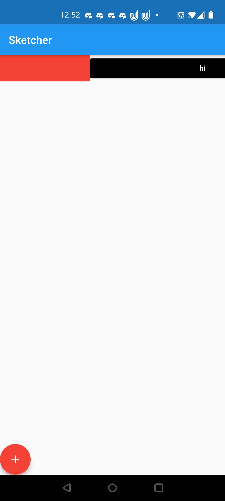

# Drawing App

### A Flutter application.

## Getting Started

### This App enables users to create simple drawings alongside which they can save those drawings. Options to rename, add another drawing drawing, and deletion have also been included. Paragraphs below explain the functioning off the app.   Happy drawing!!

## Starting the drawing
### As you can see below, we are able to draw on the screen.   Using the "floating action button" on the bottom left of the screen, we can clear the screen, and draw again.

## Saving the drawing
### Using the "floating action button" on the bottom right side of the screen, we can save the file. When we click the button, a dialogue box pops up, where we are required to enter the name of the file. After we click on save, we come to a view where all the files are visible.

  

## Viewing the drawing
### The saved drawing can be viewed by just clicking on the tile in the above picture.

## Renaming the drawing
### To rename the drawing, we are required to long press the tile in the above picture. On doing so, a dialogue box pops up, which asks us for the new name. After clicking on rename, the name of the file is now changed.

         

## Deletion of drawing
### The saved drawing can very easily be deleted by just swiping the tile towards right.

         

## Adding a new drawing from the save window.
### In the above pictures, as visible, there is a + icon on the bottom left of the screen. When it is clicked, we are reverted back to the sketcher page, and can start drawing again.

## PS: APK File is present in the 

